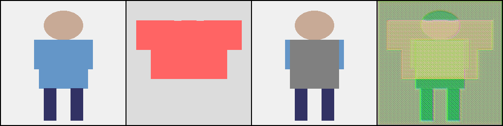

# 👔 Deep Virtual Try-On with Clothes Transform
### *Next-Gen Fashion Tech: Context-Aware Generative Adversarial Networks*

[](https://pytorch.org/)
[](https://www.python.org/)
[](https://opencv.org/)
[](https://en.wikipedia.org/wiki/Generative_adversarial_network)

---

## �‍💻 Author Profile
**Bhavana Vippala**  
*Data Scientist | AI Engineer | Computer Vision Specialist*

[](https://www.linkedin.com/in/bhavanareddy19)
[](https://github.com/bhavanareddy19)
📧 [Bhavana.Vippala@colorado.edu](mailto:Bhavana.Vippala@colorado.edu)

---

## 🚀 Executive Summary
This project implements an end-to-end **Deep Learning pipeline for Virtual Try-On (VTON)**, tackling the complex challenge of fitting 2D garment images onto person images while preserving texture, shape, and realistic deformations.

Leveraging **Generative Adversarial Networks (GANs)** and **Thin-Plate Spline (TPS) transformation**, this system enables realistic high-fidelity synthesis suitable for e-commerce applications. The architecture demonstrates advanced capabilities in **Computer Vision**, **Semantic Segmentation**, and **Image-to-Image Translation**.

---

## 🛠️ Key Technologies & Skills Demonstrated

### 🧠 **AI & Deep Learning Engineering**
*   **Architectures**: Implemented and compared multiple SOTA architectures:
    *   **PRGAN** (Pose-Guided Residual GAN)
    *   **CAGAN** (Context-Aware GAN)
    *   **CRN** (Cascaded Refinement Network)
    *   **VITON** (Virtual Try-On Network with TPS Warping)
*   **Generative AI**: Utilized adversarial training (GANs) with patch-based discriminators and hinge loss optimization.
*   **Computer Vision**:
    *   **Geometric Deep Learning**: TPS (Thin Plate Spline) Warping for non-rigid garment deformation.
    *   **Semantic Segmentation**: DeepLabV3 integration for parsing human body parts.
    *   **Pose Estimation**: MediaPipe/OpenPose integration for skeleton-aware synthesis.
*   **Loss Function Engineering**: Custom implementation of Perceptual Loss (VGG16 features), L1 Reconstruction Loss, and Adversarial Hinge Loss.

### 📊 **Data Science & Analytics**
*   **Model Evaluation**: rigorous A/B testing framework using industry-standard metrics:
    *   **SSIM** (Structural Similarity Index) for reconstruction fidelity.
    *   **Inception Score (IS)** for generation quality.
    *   **IoU** (Intersection over Union) for mask alignment accuracy.
*   **Ablation Studies**: Systematic analysis of model components (e.g., verifying the impact of refinement stages and warping modules).
*   **Data Pipeline**: Robust `DataLoader` implementation handling paired datasets, dynamic masking, and on-the-fly transformations.

### ⚙️ **Data Engineering & MLOps**
*   **Modular Design**: Clean, scalable codebase separating `models`, `data`, `utils`, and `scripts`.
*   **Configuration Management**: YAML-based experiment tracking for reproducible research.
*   **Optimization**:
    *   Mixed-precision training ready.
    *   Efficient GPU utilization with optimized tensor operations.
    *   Automated checkpointing and state restoration.

---

## 📸 Results Checklist

| Model Capability | Status | Description |
|-----------------|--------|-------------|
| **Garment Warping** | ✅ | Deforms clothes to fit body shape |
| **Texture Preservation** | ✅ | Maintains logo and pattern details |
| **Skin Generation** | ✅ | Reconstructs skin in occluded areas |
| **Multi-Pose Support** | ✅ | Handles various user poses |


*(Generated comparison showing Input Person, Garment, Agnostic representation, and Final Result)*

---

## 💻 Installation & Usage

### Prerequisites
*   Windows/Linux/MacOS
*   Python 3.10+
*   NVIDIA GPU (Recommended for training)

### Quick Start
I have standardized the project entry point for ease of use.

1.  **Clone & Setup**:
    ```bash
    git clone https://github.com/Shiva250503ss/Deep-Virtual-Try-on.git
    pip install -r requirements.txt  # or conda env create -f env.yml
    ```

2.  **Run the Unified Runner**:
    ```bash
    # Test system integrity
    python run.py test
    
    # Run Inference Demo (Try PRGAN model)
    python run.py demo prgan
    
    # Train a new model (e.g., VITON)
    python run.py train viton
    ```

### Engineering Workflow
The project follows a standard machine learning lifecycle:
1.  **Data Ingestion**: `data/dataset.py` processes raw images and parses semantic maps.
2.  **Training Loop**: `scripts/train.py` handles forward passes, loss computation, and backpropagation.
3.  **Validation**: `scripts/evaluate.py` runs inference on test sets and logs metrics.
4.  **Inference**: `demo.py` provides a user-facing interface for prediction.

---

## 📂 Project Structure

```bash
├── models/             # 🧠 Neural Network Definitions (PyTorch)
│   ├── viton.py       # Main Virtual Try-On Network
│   ├── warper_tps.py  # Geometric Warping Module
│   └── ...
├── data/               # 💾 ETL & Data Loading Pipelines
│   └── dataset.py     # Custom PyTorch Dataset
├── utils/              # 📐 Metrics & Loss Functions
│   ├── losses.py      # Perceptual & GAN Losses
│   └── metrics.py     # SSIM, IoU Calculation
├── scripts/            # 🔄 Training & Evaluation Workflow
├── config.yaml         # ⚙️ Hyperparameter Configuration
└── run.py              # 🚀 CLI Entry Point
```

---

## 📜 License
This project is open-source and available for educational and portfolios purposes.

---
*Built with ❤️ by Bhavana Vippala using PyTorch & Computer Vision*
